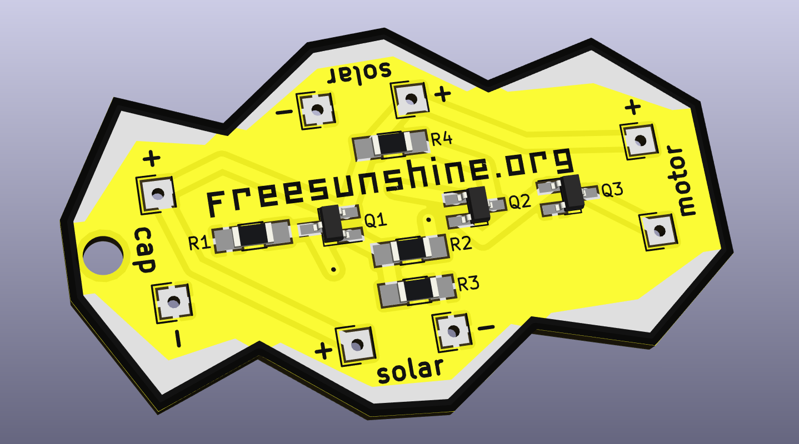

# Free Sunshine!

Promoting mechatronic art & sustainable energy in South Africa one g☼ggab☼t at a time

## What is this project about?

It is about spreading access to and an interest in electronics and art.

It also raises awareness about sustainable energy and the current development in South Africa of legislation regarding small scale solar energy generators. Find out more on the project website:

[freesunshine.org](http://freesunshine.org)

## What is a g☼ggab☼t?

A g☼ggab☼t is a small solar-powered robot. About 200 of them have been built in workshops during ISEA 2018, Durban, and subsequently at Baleni Senior Secondary School, Kwazulu Natal, South Africa.

A g☼ggab☼t consists of a printed circuit board (pcb), one or two solar cells, a motor, a capacitor and some mechanical parts. For the workshops, the pcb was pre-populated with smd components. The participants soldered the larger components to the board and added bristles, wire, beads and other things to create their individual bot.

## How can I build my own g☼ggab☼t?

We have created a pamphlet with a short description of the parts and some building instructions.

## How does the circuit work?

A schematic and a short description of the g☼ggab☼t circuit is also on the pamphlet. It was contributed by Uwe Schüler of Kulturgüter-Schuppen, Dusslingen, Germany.

[www.kulturgueter-schuppen.de](http://www.kulturgueter-schuppen.de)

## How was the pcb made?

The pcb was created using KiCad Version 4.0.7. The boards were manufactured by PCBWay, and assembled by R2 manufacturing.

This is a rendering of the front:

## License

The g☼ggab☼t circuit is CC NC BY kulturgueter-schuppen.de.